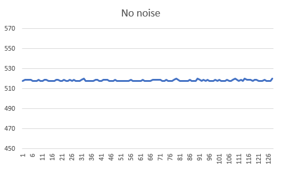
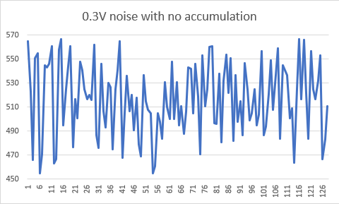
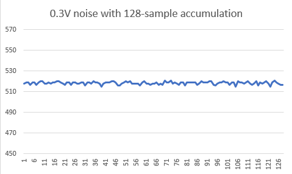

# Random Noise Cancellation Demo
This test sketch dmonstrates performing noise cancellation on a signal with
random noise added by using sample accumulation.

## Instructions
1. Connect the signal generator board to your Curiosity Nano, with the signal output
connected to A0 (PD0)
2. Configure the signal generator to output 1.25V constant DC voltage
3. Configure the signal generator to output the desired level of random noise
4. Upload the `randomNoise.ino` sketch to your AVRDA board.
5. Open a serial monitor to view the recorded readings.

## Expected Output
When the hardware is configured as specified and `randomNoise.ino` is executed, the ADC
will receive an input voltage of 1.25V with noise added and will have a reference voltage
of 2.5V. Under these conditions, the average reading from the ADC should approximately
(1.25V / 2.5V) * 1024 = 512. When noise is added to the signal, the average reading should
remain the same but there will be more variance in the readings as more noise is added.

When sample accumulation is enabled, a series of samples will be taken and averaged by the test
sketch. It is expected that this will result in readings with a lower variance as more samples
are used. 

## Results
Full results are recorded in `results.xlsx`. Results were collected for a base input of 1.25V
with 0.05V, 0.1V, and 0.3V of noise added with varying levels of sample accumulation. 

For all noise and accumulation levels, the average ADC reading with approximately 518 as compared to 
the expected value of 512. As expected, the average reading remained the same regardless of 
noise or accumulation settings, with the only difference between different configurations being
the variance of the readings. 

The lowest variance reading was recorded when no noise was added to the signal (Figure 1). When
noise was added to the signal, a significant amount of variance in the readings was introduced,
with the readings for 0.3V of noise with no accumulation shown in Figure 2. However, as expected,
enabling sample accumulation resulted in a significantly lower sample variance, shown in Figure 3. 

Figure 1: ADC readings for 1.25V with no noise added

Figure 2: ADC readings for 1.25V with 0.3V of noise added

Figure 3: ADC readings for 1.25V with 0.3V noise added and 128 samples accumulated and averaged

These results were as expected and demonstrate the effectiveness of sample accumulation as a 
noise reduction technique.
