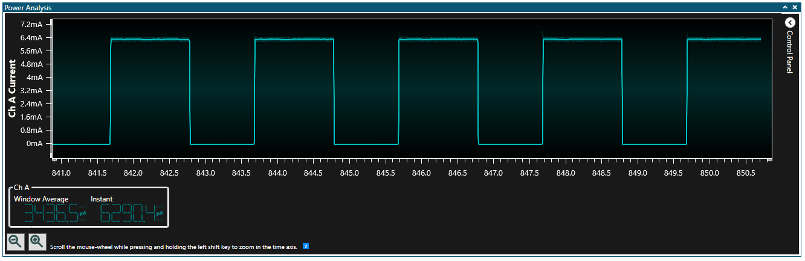
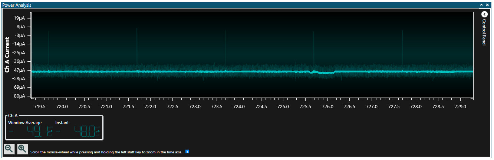

# `sleepUntilTWIMatch` Test Case
This test case validates the ability for the system to wake when the correct address is received over TWI

## Instructions
1. Connect the I2C connections of the Curiosity Nano board and an Arduino Uno compatible board, such as an Arduino Nano, Arduino Uno, or ATmega328p XPlained Mini. No external pull-up resistors are required. Ensure that the ground pins of each board are connected,
2. Connect the Curiosity Nano board to your computer
3. Connect the Curiosity Nano power supply in series with an ammeter such as a multimeter or AVR power debugger (recommended)
4. Download the "slave" sketch to the Curiosity Nano board.
5. Connect the Arduino Uno compatible board to your computer
6. Download the "master" sketch to the Uno compatible board.
7. Open a serial console in the COM port that the Curiosity Nano is on, either using the built-in serial console in the Arduino IDE or using a separate program like PuTTY. Set the Baud rate to **115200**.
8. Observe that the Curiosity Nano sends messages when entering various sleep modes, as well as when the system receives a valid address over TWI.
9. Open a serial console in the COM port that the Arduino Uno compatible board is on. Set the Baud rate to **57600**.
10. Observe that the Arduino Uno compatible board sends "Sending message to slave!" every 2 seconds.
11. Verify using the ammeter that the system enters sleep, and then exits sleep upon the receipt of a valid TWI address, by default every 2 seconds. 
Example:

12. Revise the `twiAddress` in the master sketch to a valid value other than 0x08, such as 0x0A.
13. Download the master sketch to the arduino uno compatible board.
14. Observe using the ammeter and the Curiosity nano board's serial output that it no longer wakes from sleep, as the address is not correct. If the ammeter is sufficiently fast reacting, you may see small power spikes as the system received the invalid address. 
Example:
