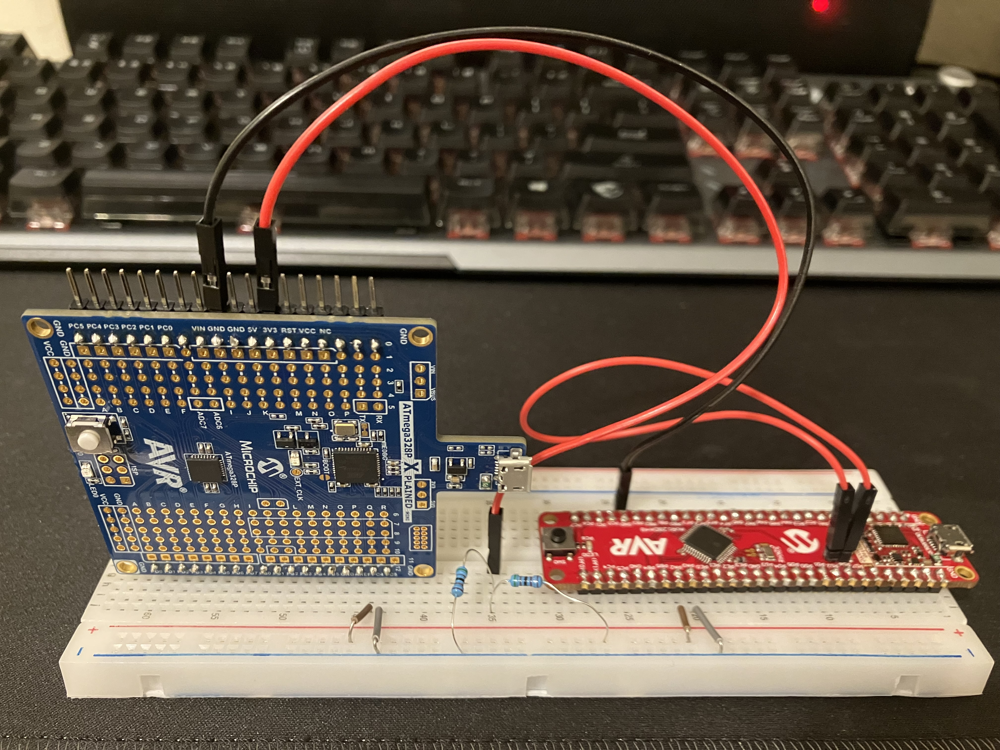
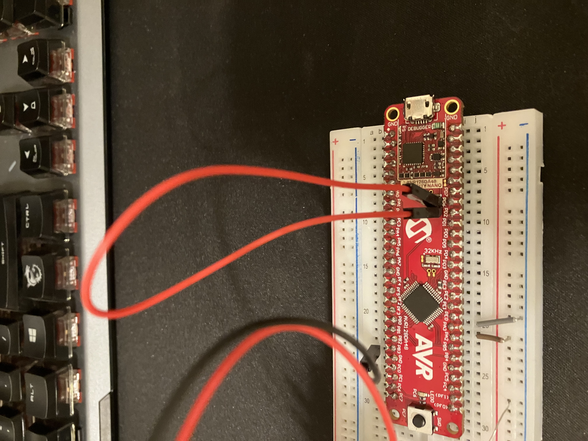
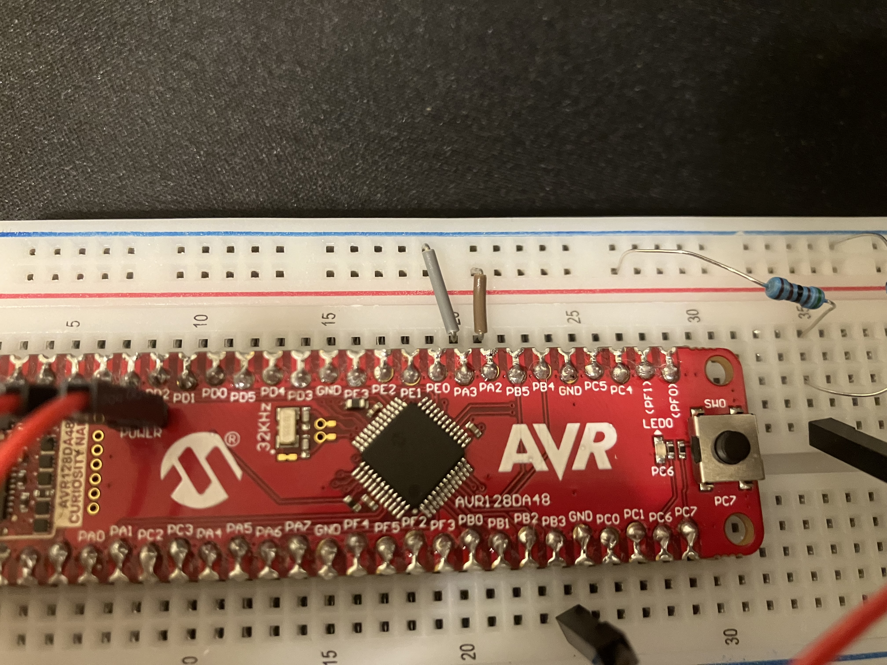
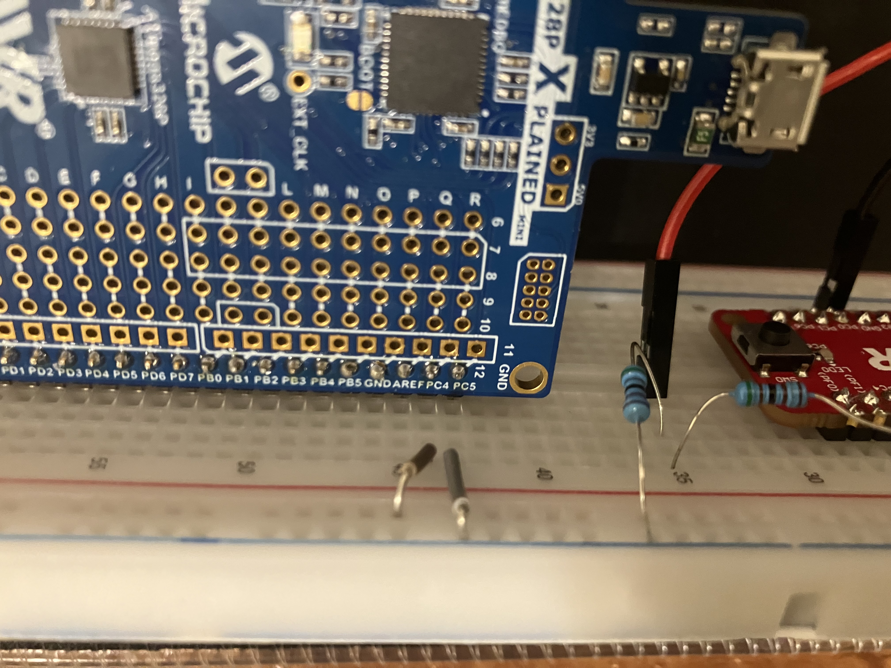
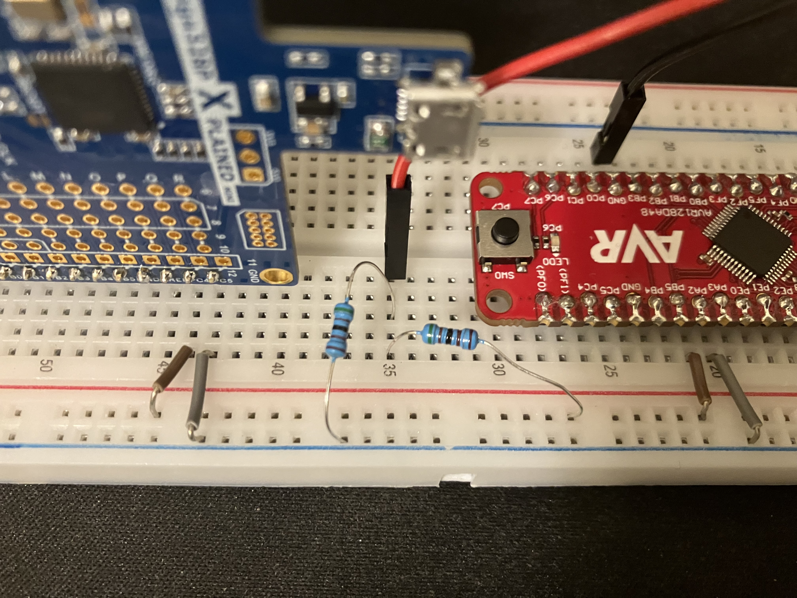
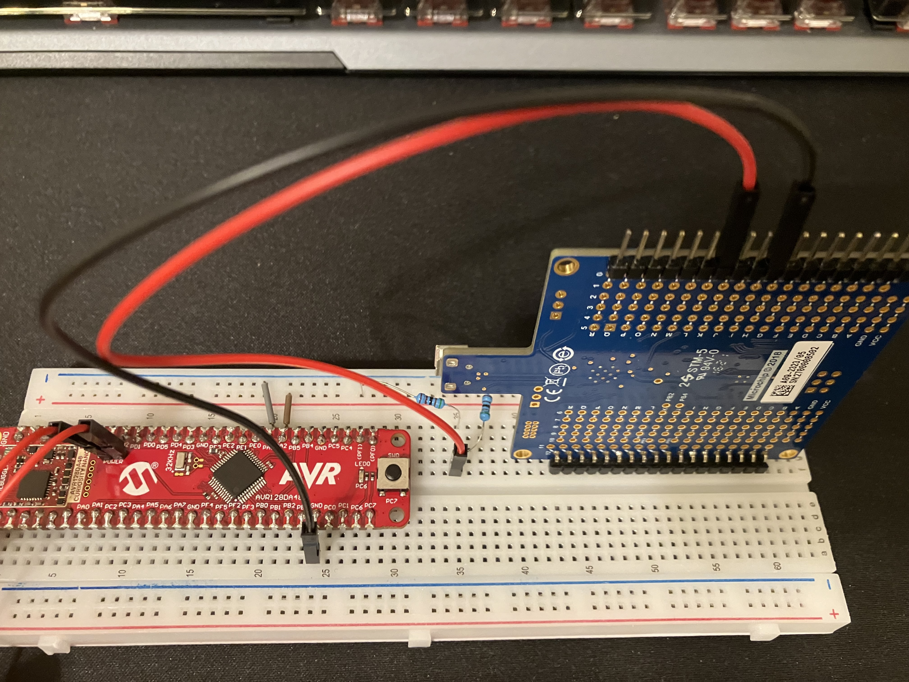
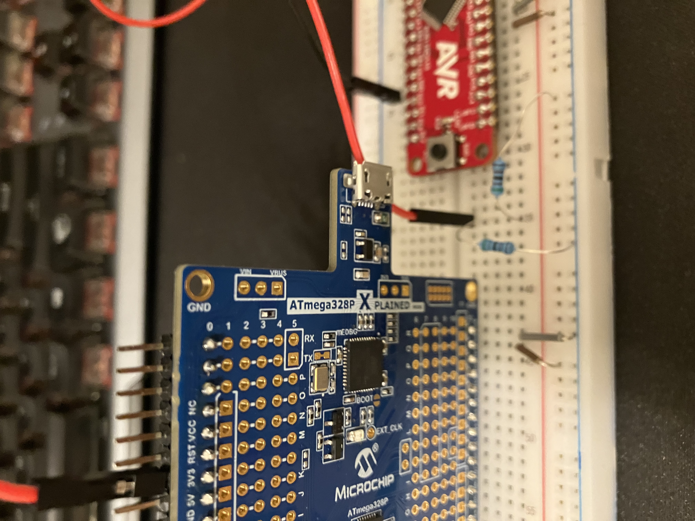

# TWI Hookup for AVR128DA48 Curiosity Nano and ATmega328P Xplained Mini
## Created by Alben Trang and Jude Brauer

This document details how to connect the AVR128DA48 Curiosity Nano and ATmega328P Xplained Mini boards to create a system for TWI Address Matching.

1. You will need both boards and other components to connect different parts of the them.

### Figure 1 - Overall view of the TWI match system

2. If the POWER strap of the DA board has been cut, use something like a female-to-female wire to connect the two pins that were connected by the POWER strap.

### Figure 2 - Connecting the pins from the POWER strap of the DA board

3. Start a connection from PA2 (SDA) and PA3 (SCL) using something like male-to-male wires.

### Figure 3 - Wires connecting DA's PA2 and PA3 utilizing the buses/rails

4. Make another connection from the ATmega board from PC4 (SDA) and PC5 (SCL) using something like male-to-male wires.

### Figure 4 - Wires connecting ATmega's PC4 and PC5 utilizing the buses/rails

5. Between the connections of the SDA and SCL, use two resistors that about 5k Ohm each between the connections. These will be the external pullup resistors that will keep the connections HIGH. See [here](https://github.com/cgjeffries/DxCore/tree/master/megaavr/libraries/Wire) for more information.

### Figure 5 - Resistors connecting to the 3v3 pin from the ATmega board

6. The resistors need to be connected to the 3v3 pin on the ATmega board because the pins from the DA board are 3.3 volts.

### Figure 6 - The 3v3 pin and the GND pin of the ATmega board's connections

7. Use something like a female-to-male jumper wire to connect the 3v3 pin of the ATmega board to the resistors.

### Figure 7 - The 3v3 pin of the ATmega board connecting to the resistors

8. There is also a connection from the GND of the DA board to the GND of the ATmega board. This connection is not needed if the two boards are connected to a power source that already has ground connected in it.

### Figure 8 - Female-to-male wires comming from the GND and 3v3 pins of the ATmega board

9. Use the two Arduino .ino programs to use TWI connection. The master (ATmega board) will have user input from a Serial monitor, and the slave (DA board) will wait for a message from the master board using TWI address matching. For those demo programs, the slave will also wake up from standby mode because TWI address matching is an interrupt.