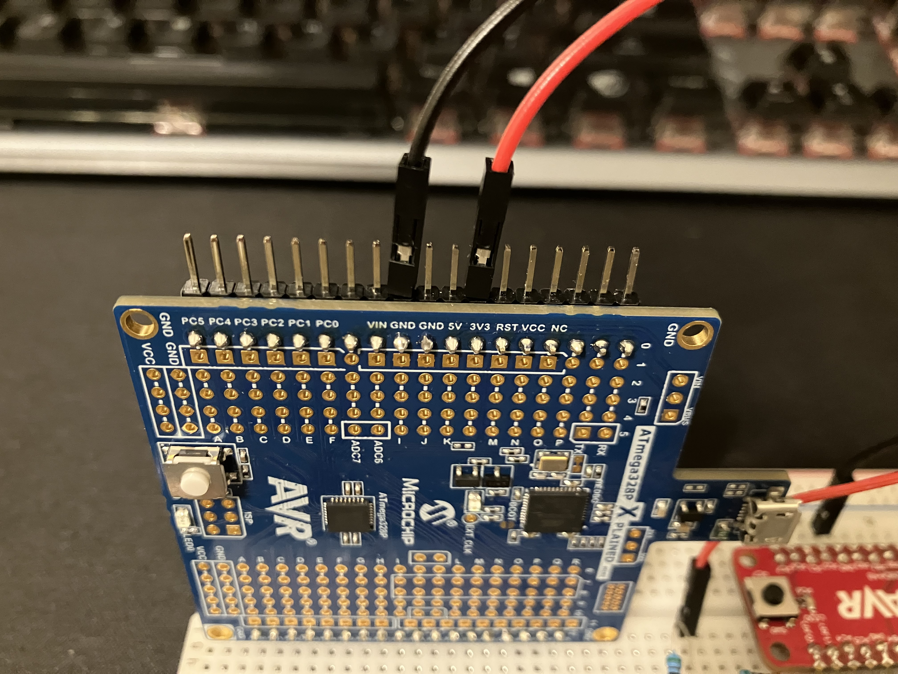

# TWI Hookup for AVR128DA48 Curiosity Nano and ATmega328P Xplained Mini
## Created by Alben Trang and Jude Brauer

This document details how to connect the AVR128DA48 Curiosity Nano and ATmega328P Xplained Mini boards to create a system for TWI Address Matching.

1. You will need both boards and other components to connect different parts of them.

Figure 1 - Overall view of the TWI match system

2. If the POWER strap of the DA board has been cut, use a jumper wire to connect the two pins that were connected by the POWER strap.

Figure 2 - Connecting the pins from the POWER strap of the DA board

3. Start a connection from PA2 (SDA) and PA3 (SCL) using jumper wires.

Figure 3 - Wires connecting DA's PA2 and PA3 utilizing the buses/rails

4. Make another connection from the ATmega board from PC4 (SDA) and PC5 (SCL) using jumper wires.

Figure 4 - Wires connecting ATmega's PC4 and PC5 utilizing the buses/rails

5. As documented [here](https://github.com/cgjeffries/DxCore/tree/master/megaavr/libraries/Wire), external pullup resistors are required on the SDA and SCL signal lines. Resistors of about 2k-10k Ohms are recommended. To add the pullups, first connect your pullup resistors to both SCL and SDA.

Figure 5 - Pullup resistors connecting to SDA and SCL

6. Next, connect both pullup resistors to a 3.3V voltage source. The 3v3 pin on the XPlained Mini board can be used.

Figure 6 - The 3v3 pin and the GND pin of the ATmega board's connections

7. Add a connection from the GND of the DA board to the GND of the ATmega board. This connection is not needed if the two boards are connected to a power source that already has ground connected in it.

Figure 8 - Female-to-male wires coming from the GND and 3v3 pins of the ATmega board

8. Use the two Arduino .ino programs to use TWI connection. The master (ATmega board) will have user input from a Serial monitor, and the slave (DA board) will wait for a message from the master board using TWI address matching. For those demo programs, the slave will also wake up from standby mode because TWI address matching is an interrupt.
